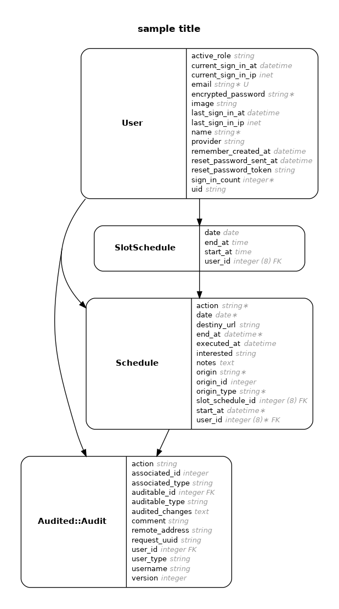

# README

This README would normally document whatever steps are necessary to get the
application up and running.

Things you may want to cover:

* Ruby version

* System dependencies

* Configuration

* Database creation

* Database initialization

* How to run the test suite

* Services (job queues, cache servers, search engines, etc.)

* Deployment instructions

# Diagrama do Data Base

Para atualizar o diagrama, rodar no bash:

bundle exec erd

Para copiar na pasta local:

docker cp 3ac6f6b1433e:/usr/src/app/erd.png destino

Trocar o ID do container

Comando para ver o ID do container:

docker container ls
